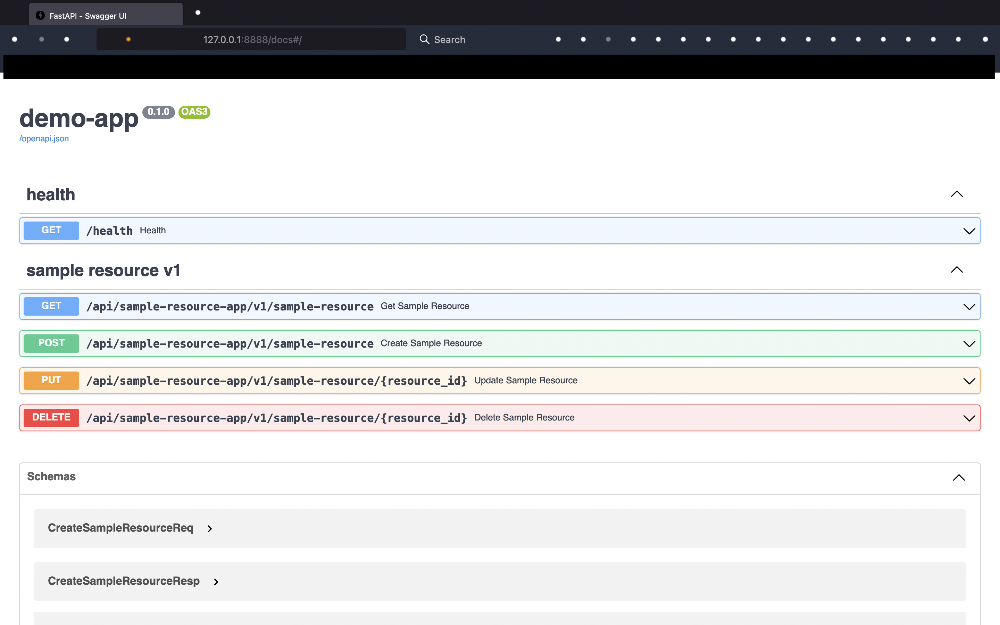

# Backend FastAPI and MongoDB - Project Template


A [Cookiecutter](https://github.com/cookiecutter/cookiecutter) template that scaffolds production-ready async RESTful API services built with **FastAPI**, **Motor** (async MongoDB driver), and **uv** for fast dependency management. Spin up a fully structured, tested, and containerized backend in seconds.



---

## ✨ Features

Each project generated from this template includes:

- **Async REST API** — high-performance endpoints powered by [FastAPI](https://fastapi.tiangolo.com/) and [Uvicorn](https://www.uvicorn.org/).
- **Async MongoDB CRUD** — full Create / Read / Update / Delete operations via [Motor](https://motor.readthedocs.io/en/stable/).
- **Health endpoint** — `/health` route for liveness and readiness checks.
- **Swagger / OpenAPI docs** — auto-generated interactive API documentation at `/docs`.
- **Structured logging** — YAML-based logging config with environment-variable overrides and ID masking.
- **Custom error handling** — `BadRequest` and `UnprocessableError` exceptions with RFC 7807-style JSON responses.
- **Test suite** — async tests with [pytest](https://docs.pytest.org/) and [pytest-asyncio](https://github.com/pytest-dev/pytest-asyncio) covering all CRUD operations and the health endpoint.
- **Docker support** — `Dockerfile` and `docker-compose.yml` included.
- **Makefile shortcuts** — one-command test, dev run, image build, and compose up/down.
- **uv package manager** — 10-100× faster dependency resolution than pip/Poetry.

---

## 🏗️ Project Architecture

### Repository Layout (this template)

```
cookiecutter-fastapi-mongo/
├── cookiecutter.json               # Template variables (project name, DB config, etc.)
├── hooks/                          # Cookiecutter lifecycle hooks (post-generate setup)
├── {{cookiecutter.project_dir_name}}/  # Template source — rendered into your new project
│   ├── app/                        # Application package
│   ├── tests/                      # Test suite
│   ├── Dockerfile
│   ├── docker-compose.yml
│   ├── Makefile
│   ├── pyproject.toml
│   └── env.sample
├── website/                        # Project website (GitHub Pages)
└── Makefile                        # Template-level CI targets
```

### Generated Project Layout

```
<your-project>/
├── app/
│   ├── server.py          # FastAPI app factory — registers routes, middleware, lifecycle events
│   ├── error.py           # Custom exception classes (BadRequest, UnprocessableError)
│   ├── util.py            # Shared utility helpers
│   ├── api/
│   │   ├── health.py      # GET /health
│   │   └── v1/
│   │       └── sample_resource.py   # Versioned CRUD router
│   ├── models/
│   │   ├── create_sample_resource.py    # Request body model
│   │   ├── get_sample_resource.py       # Response model
│   │   ├── sample_resource_common.py    # Shared field definitions
│   │   └── mongo_model.py               # MongoDB document base model
│   ├── dao/
│   │   └── sample_resource.py   # Data Access Object — all DB queries live here
│   ├── db/
│   │   └── db.py          # Motor client — connect/disconnect lifecycle hooks
│   └── conf/
│       ├── config.py      # App settings loaded from environment variables
│       └── logging.yaml   # Logging configuration
├── tests/
│   ├── conftest.py
│   ├── mongo_client.py    # Test DB client fixture
│   ├── mock_data/         # Fixtures / seed data for tests
│   ├── test_health.py
│   ├── test_create_sample_resource.py
│   ├── test_get_sample_resource.py
│   ├── test_update_sample_resource.py
│   └── test_delete_sample_resource.py
├── Dockerfile
├── docker-compose.yml
├── Makefile
├── pyproject.toml
└── env.sample
```

### Request Flow

```
HTTP Request
     │
     ▼
FastAPI Router  (app/api/)
     │   validates request body via Pydantic models (app/models/)
     ▼
Data Access Object  (app/dao/)
     │   async Motor queries
     ▼
MongoDB
     │
     ▼
Pydantic Response Model  →  JSON Response
```

### Layer Responsibilities

| Layer | Path | Responsibility |
|---|---|---|
| **Router** | `app/api/` | HTTP method binding, request validation, response serialisation |
| **Model** | `app/models/` | Pydantic schemas for requests, responses, and MongoDB documents |
| **DAO** | `app/dao/` | All database queries; the only layer that touches Motor/MongoDB |
| **DB** | `app/db/` | Motor client lifecycle (connect on startup, disconnect on shutdown) |
| **Config** | `app/conf/` | Environment-variable-driven settings and structured logging |

### Key Dependencies

| Package | Purpose |
|---|---|
| [FastAPI](https://fastapi.tiangolo.com/) | Async web framework |
| [Motor](https://motor.readthedocs.io/) | Async MongoDB driver |
| [Uvicorn](https://www.uvicorn.org/) + [Gunicorn](https://gunicorn.org/) | ASGI server |
| [Pydantic](https://docs.pydantic.dev/) | Data validation (bundled with FastAPI) |
| [PyYAML](https://pyyaml.org/) | Logging configuration |
| [pytest-asyncio](https://github.com/pytest-dev/pytest-asyncio) | Async test support |
| [uv](https://docs.astral.sh/uv/) | Package and virtual-environment management |

---

## 📋 Prerequisites

| Tool | Install |
|---|---|
| Python 3.10+ | [python.org](https://www.python.org/downloads/) |
| uv | `curl -LsSf https://astral.sh/uv/install.sh \| sh` |
| Cookiecutter | `pip install cookiecutter` |
| Docker | [docs.docker.com](https://docs.docker.com/get-docker/) |
| GNU Make | Included on macOS/Linux |

---

## 🚀 Getting Started

### 1 — Generate a New Project

Go to the directory where you want your new service, then run:

```sh
cookiecutter gh:klee1611/cookiecutter-fastapi-mongo
```

Cookiecutter will prompt for project settings (name, DB name, author, etc.), scaffold the project, and automatically install dependencies with uv.

**All subsequent commands must be run inside the newly created project directory.**

### 2 — Configure Environment Variables

Copy the sample file and edit values to match your environment:

```sh
cp env.sample .env
# then edit .env
```

Key variables:

| Variable | Description |
|---|---|
| `MONGODB_URL` | Full MongoDB connection string |
| `MONGODB_DBNAME` | Database name |
| `MAX_CONNECTIONS_COUNT` | Motor connection pool maximum |
| `MIN_CONNECTIONS_COUNT` | Motor connection pool minimum |
| `LOG_LEVEL` | Logging level (`DEBUG`, `INFO`, `WARNING`, `ERROR`) |
| `TEST_MONGODB_URL` | MongoDB URL used by the test suite |
| `TEST_DB_NAME` | Separate database used by the test suite |

### 3 — Run the Test Suite

```sh
make test
```

This spins up a temporary MongoDB container, runs all pytest tests, then tears down the container automatically.

### 4 — Run the Service Locally

```sh
make dev
```

Starts a MongoDB container and runs the API server with hot-reload at `http://localhost:8888`.

### 5 — Explore the API

Open your browser at `http://localhost:8888/docs` for the interactive Swagger UI.

---

## 🐳 Docker

### Build the Image

```sh
make docker-build
```

### Run with Docker Compose

```sh
make docker-compose-up   # build & start API server + MongoDB
make docker-compose-down # stop & remove containers, volumes, and images
```

---

## 🔄 Migration from Poetry

If you were using an earlier version of this template that used Poetry, see [MIGRATION.md](MIGRATION.md) for the uv migration guide.

---

## 🌐 Website Deployment

The project website lives in `website/`. To publish updates to GitHub Pages:

```sh
cd website
npm install
npm run deploy
```

This pushes `website/public/` to the `gh-pages` branch via the `gh-pages` npm package.

---

## 🤝 Contributing

Pull requests are welcome! For significant changes, please open an issue first to discuss the proposal.

---

## 💬 Feedback & Support

- Open a [GitHub issue](https://github.com/klee1611/cookiecutter-fastapi-mongo/issues) for bugs or feature requests.
- Check existing issues before opening a new one.

---

## ☕ Support This Project

If this template saves you time, consider buying the author a coffee:

[](https://www.buymeacoffee.com/klee1611)

Happy coding! 🚀

