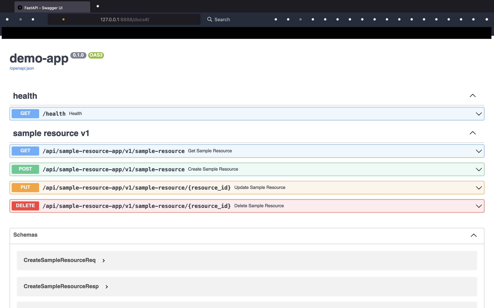

# Backend FastAPI and MongoDB - Project Template


This is a backend boilerplate designed for high-performance RESTful APIs using FastAPI and Motor, an asynchronous driver for MongoDB. It includes a health API for service health checking, basic CRUD operations for a sample resource, Swagger API documentation, and Docker support. Additionally, this boilerplate uses Cookiecutter, allowing for easy creation of new backend services.



## Features
A new backend project created with this boilerplate provides:
- [x] Asynchronous high-performance RESTful APIs built upon [FastAPI](https://fastapi.tiangolo.com/) framework.
- [x] Asynchronous CRUD operations for a sample resource built upon [Motor](https://motor.readthedocs.io/en/stable/) driver for MongoDB, providing high performance and efficiency.
- [x] API documentation with [Swagger UI](https://swagger.io/tools/swagger-ui/).
- [x] API testing with [pytest](https://docs.pytest.org/en/7.1.x/) and [pytest-asyncio](https://github.com/pytest-dev/pytest-asyncio).
- [x] Dockerfile for containerization and docker-compose support.
- [x] Easy creation of new backend services with [cookiecutter](https://github.com/cookiecutter/cookiecutter).
- [x] Easy package menagement with [Poetry](https://python-poetry.org/).
- [x] Health API for service health checking.
- [x] Easy configuration with environment variables.
- [x] Easy testing, develop running, docker build, docker-compose up and down with Makefile.
- [x] Proper logging with ID masking.

## Prerequisites
- Python 3.10+
- [Poetry](https://python-poetry.org/) installed
- [Cookiecutter](https://github.com/cookiecutter/cookiecutter) installed
- Docker installed
- GNU Make

## Getting Started

### Create A New Service
With [Cookiecutter](https://github.com/cookiecutter/cookiecutter),  
you don't have to fork this project to create a new service.  

Go to the directory where you want to place your new backend project,  
and create the new project with:

```sh
cookiecutter gh:klee1611/cookiecutter-fastapi-mongo
```

After the project folder is created,  
all packages required will be installed automatically.  

### Edit Environment Variables
Edit the `.env` file within the project folder.

### Run Tests
```sh
make test
```

### Build Docker Image
```sh
make docker-build
```

### Docker-compose
```sh
make docker-compose-up
make docker-compose-down
```

### Run Service Locally
```sh
make dev
```
This will create a MongoDB container as well.

### Check Swagger API Document
Go to ` http://localhost:8888/docs`.

## Contributing
Pull requests are welcome. For major changes, please open an issue first to discuss what you.
